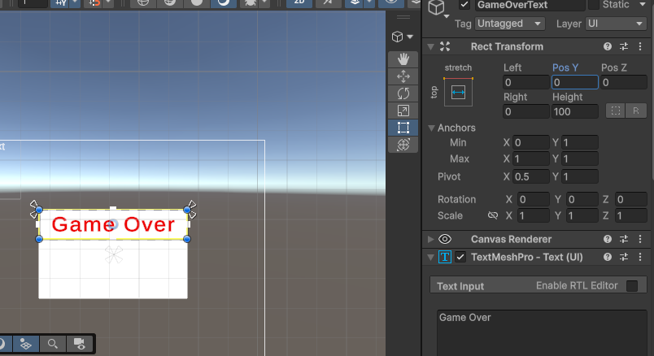
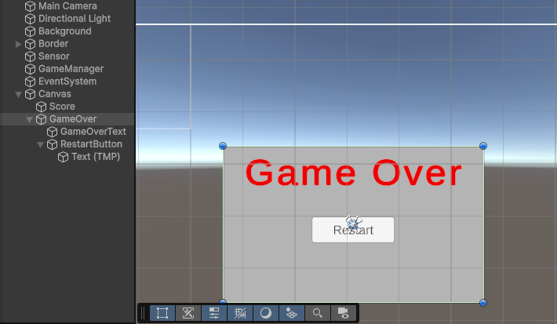
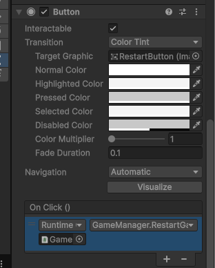

# Clicky Mouse Game Guidelines

## Overview

1.0 Open scene `Main`. And look at Prefabs/ we could see `Bad-1`, `Good-1`, `Good-2`, ...
1.1 Press Play, and toss them into scene. They are falling down.
1.2 Explain what we are going to do in this lab. We will make a game where we click on the targets to get points. But player need to avoid clicking on the bad targets. We will use the prefabs as our targets, and we will spawn them randomly in the scene.

---

## Step 1: make Target Object toss around

1.0 In Start method, we will make the Target move by adding a random force and also a random torque to it.

```c#
    void Start()
    {
        rb = GetComponent<Rigidbody>();
        rb.AddForce(Vector3.up * Random.Range(12, 16), ForceMode.Impulse);
        rb.AddTorque(Random.Range(-10, 10), Random.Range(-10, 10),
        Random.Range(-10, 10), ForceMode.Impulse);
        transform.position = new Vector3(Random.Range(-4, 4), -6); }
    }
```

1.1 Look at the code above, we could see some messy code. We have magic numbers everywhere, and it's hard to understand what they mean. We can improve this code by wrapping the random logic in methods.

```c#
    void Start()
    {
        rb = GetComponent<Rigidbody>();

        rb.AddForce(RandomForce(), ForceMode.Impulse);
        rb.AddTorque(RandomTorque(), RandomTorque(), RandomTorque(), ForceMode.Impulse);
        transform.position = RandomSpawnPos();
    }
```

We could see the random logic is wrapped in the RandomForce, RandomTorque, and RandomSpawnPos methods. Those method are already implemented for you. You can take a look at them to understand how they work, but you don't need to change them.

Note on wrapping logic in methods: This is a good practice to keep your code clean and organized. It also makes it easier to read and understand. By wrapping the random logic in methods, we can easily reuse the code and make it more modular.

---

## Step 2: Create a Game Manager to manage the game state

2.0 In scene, we see a GameObject called `GameManager`. This is where we will manage the game state, such as the score, and the game over state.

We have already add some variables including UI Elements, and List of targets. We will use these variables to update the score and display the game over screen.

2.1 Lets handle list of targets first. We use it for our spawner to spawn targets when the game starts. Look at `Start()` method, it call `StartCoroutine(SpawnTarget())`. in SpawnRouter Coroutine, we will implement logic to spawn the object intervally.

Please notice that the target list `targets` is List instead of array that we used to use. List is more flexible than array, and it's easier to add and remove elements from a List. We will use List to store our targets, and we will spawn them randomly in the scene. It use Count to get the number of elements in the List, and we use Random.Range to get a random index to spawn the target.

```c#
    IEnumerator SpawnTargets()
    {
        while (true)
        {
            yield return new WaitForSeconds(spawnRate);
            int index = Random.Range(0, targets.Count);
            Instantiate(targets[index]);
        }
    }
```

2.2 add each Bad and Good target prefabs to the `targets` list in the inspector. We will use this list to spawn targets randomly in the scene. And Play the game to see if the targets are spawning correctly.

---

## Step 3: Create a Target Script, and make it clickable

3.0 Take a look at the `Target` script. We have IPointerClickHandler implemented. In Unity3D, IPointerClickHandler is an interface that allows us to detect when a user clicks on a GameObject. By implementing this interface, we can define what happens when the user clicks on the target.

We have OnPointerClick method implemented. This method is called when the user clicks on the target. This is Part of Unity's Event System. We will use this method to detect clicks on the target and update the score accordingly.

3.1 Add `OnPointerClick` method to the `Target` script. In this method, we will check if the target is a good target or a bad target. If it's a good target, we will add points to the score. If it's a bad target, we will subtract points from the score.

```c#
    public void OnPointerClick(PointerEventData eventData)
    {
        Destroy(gameObject);
    }
```

3.2 We already have `Sensor` object below the scene. It is being used to detect when the target falls down. We will use this object to detect when the target falls down. So in `Target.cs`, implement `OnTriggerEnter` method to detect when the target falls down. If the target falls down, we will check if it's a good target or a bad target. If it's a good target, we will subtract points from the score. If it's a bad target, we will add points to the score.

```c#
    private void OnTriggerEnter(Collider other)
    {
        Destroy(gameObject);
    }
```

## Step 4: Update the score and display the game over screen

4.0 This is for introduction of UI. First lets create a UI Text to display the score. In the Hierarchy, right click and select UI -> Text - TextMeshPro, and name it `Score`.

Play around with its properties...

- Set the text to "Score: 0"
- Set the font size to 36
- Set the color to white
- Set the alignment to center
- Set the position to (0, 200)

And guide syudent to use Anchor, and notice the Min/Max values for each Anchor preset. We will use Anchor to make sure our UI elements are positioned correctly on different screen sizes.

- Set the Anchor to Top Center
- Set the Anchor to Top Left
- Set the Anchor to Top Right
- Set the Anchor to Middle Center

and each change, resize to screen to see how the UI element is positioned.

And show them how to set Pivot to make the UI element rotate around a specific point. We will use Pivot to make sure our UI elements are rotated correctly when we rotate the screen.

It could have quite much different when placing the UI element at the edge of the screen. If you want UI Element's left edge to be fixed at the left edge of the screen. Using Anchor with proper Pivot is the key to achieve that. For example, if we want the left edge of the UI element to be fixed at the left edge of the screen, we can set the Anchor to Top Left, and set the Pivot to (0, 0.5). This way, when we resize the screen, the left edge of the UI element will always be fixed at the left edge of the screen.

4.1 In `GameManager.cs`, we have `private int score;` variable to keep track of the score. We also have `public TextMeshProUGUI scoreText;` variable to reference the UI Text we just created. We will use these variables to update the score and display it on the screen. Let initialize the score to 0 in the Start method, and update the scoreText to display the initial score.

```c#
    void Start()
    {
        score = 0;
        scoreText.text = "Score: " + score;
        StartGame();
    }
```

4.2 create `UpdateScore(int scoreToAdd)` method in `GameManager.cs` to update the score and display it on the screen. This method will take an integer parameter `scoreToAdd` which will be added to the current score. After updating the score, we will also update the scoreText to display the new score.

```c#
    public void UpdateScore(int scoreToAdd)
    {
        score += scoreToAdd;
        scoreText.text = "Score: " + score;
    }
```

And In `Start()` method, we will call `UpdateScore(0);` to initialize the score display.

4.3 Now we need to call `UpdateScore` method when the target is clicked. In `Target.cs`, we will call `UpdateScore` method in `OnPointerClick`.

But first, we need a reference to the `GameManager` in the `Target` script. We can use `FindObjectOfType<GameManager>()` to get a reference to the `GameManager` in the scene.

```c#
    private GameManager gameManager;

    void Start()
    {
        rb = GetComponent<Rigidbody>();
        gameManager = FindAnyObjectByType<GameManager>();

        rb.AddForce(RandomForce(), ForceMode.Impulse);
        rb.AddTorque(RandomTorque(), RandomTorque(), RandomTorque(), ForceMode.Impulse);
        transform.position = RandomSpawnPos();
    }
```

and here is how we call `UpdateScore` method in `OnPointerClick` method. We will check if the target is a good target or a bad target, and update the score accordingly.

```c#
    public void OnPointerClick(PointerEventData eventData)
    {
        gameManager.UpdateScore(point);
        Destroy(gameObject);

    }
```

Ask student to change Bad Target's point value to -5, and Good Target's point value to 1 or 2. And play the game to see if the score is updated correctly when we click on the targets.

4.4 To make it more interesting by add particle system when we click on the target. We have already add a `public ParticleSystem explosionParticle;` variable in the `Target` script. We will use this variable to reference the particle system prefab that we want to play when we click on the target.

```c#
    public void OnPointerClick(PointerEventData eventData)
    {
        gameManager.UpdateScore(point);
        Instantiate(explosionParticle, transform.position, explosionParticle.transform.rotation);
        Destroy(gameObject);
    }
```

---

## Step 5: Manage Game Over state

5.0 First create Game Over Screen Element, using Reactangle. and inside ti has Game over text in the UI. In the Hierarchy, right click and select UI -> Text - TextMeshPro, and name it `GameOverText`. and hide GameOverScreen in the inspector. We will show this text when the game is over.



5.1 we will show GameOver Screen, if we miss a good target and falls.

```c#
    private void OnTriggerEnter(Collider other)
    {
        Destroy(gameObject);
        if (!gameObject.CompareTag("Bad"))
        {
            gameManager.GameOver();
        }
    }
```

5.2 Once Game is over, we need to stop anything. we introduce a flag `isGameActive` to check if the game is active or not. If the game is not active, we will not spawn any targets, and we will not update the score.

```c#
public class GameManager : MonoBehaviour
{
    ...
    ...
    private bool isGameActive = true;
    ...
    ...
```

```c#
    void StartGame()
    {
        ...
        ...
        isGameActive = true;
    }
```

```c#
    public void GameOver()
    {
        gameOverScreen.SetActive(true);
        isGameActive = false;
    }
```

5.3 next we will add `Restart` button to restart the game. In the Hierarchy, right click and select UI -> `Button - TextMeshPro`, and name it `Restart Button`. And set its text to "Restart". We will use this button to restart the game when it's over. Dont forget to set GameManager's restartButton variable to reference this button in the inspector.



5.4 In `GameManager.cs`, we will add a method `RestartGame()` to restart the game. This method will reload the current scene to start the game again.

```c#
    public void RestartGame()
    {
        SceneManager.LoadScene(SceneManager.GetActiveScene().name);
    }
```

5.5 we have two ways to call `RestartGame()` method when the Restart button is clicked. We can either add an OnClick event in the inspector, or we can add a listener to the button in the Start method.

first approach: add an OnClick event in the inspector. Select the Restart Button in the Hierarchy, and in the Inspector, scroll down to the Button component, and click on the + button to add a new OnClick event. Then drag the GameManager object from the Hierarchy to the empty field, and select `GameManager.RestartGame` from the dropdown.



second approach: add a listener to the button in the Start method. In `GameManager.cs`, we will add a listener to the Restart button in the Start method.

```c#
    void Start()
    {
        restartButton.onClick.AddListener(RestartGame);
        ...
        ...
    }
```

5.ENDINGNOTE: dont forget to hide GameOver screen before start the game. Or we can ensure that GameOver screen is hidden when we restart the game by adding `gameOverScreen.SetActive(false);` in the `StartGame()` method.

```c#
    void StartGame()
    {
        ...
        ...
        gameOverScreen.SetActive(false);
        isGameActive = true;
    }
```

---
